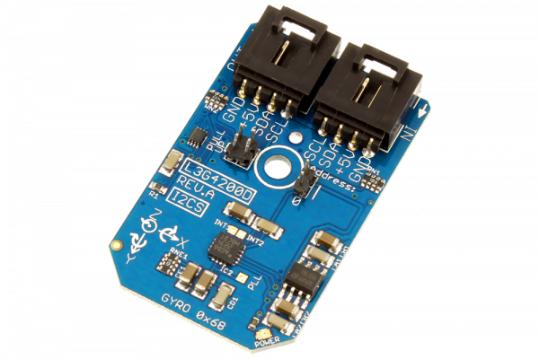

[](https://store.ncd.io/product/l3g4200d-mems-motion-sensor-ultra-stable-3-axis-gyroscope-i2c-mini-module/).

# L3G4200D

The L3G4200D, manufactured by STMicroelectronics, is a low-power three-axis angular rate sensor which provides unprecedented stability of zero rate level and sensitivity over temperature and time.The IC interface is manufactured using a CMOS process that allows a high level of integration to design a dedicated circuit. The L3G4200D has a full scale of ±250/±500/±2000°/sec and is capable of measuring rates with a user-selectable bandwidth.
This Device is available from www.ncd.io

[SKU: L3G4200D]

(https://store.ncd.io/product/l3g4200d-mems-motion-sensor-ultra-stable-3-axis-gyroscope-i2c-mini-module/)
This Sample code can be used with Raspberry Pi.

Hardware needed to interface L3G4200D 3Axis gyroscope sensor With Raspberry Pi :

1. <a href="https://store.ncd.io/product/l3g4200d-mems-motion-sensor-ultra-stable-3-axis-gyroscope-i2c-mini-module/">L3G4200D ultra stable 3Axis gyroscope Sensor</a>

2. <a href="https://store.ncd.io/product/i2c-shield-for-raspberry-pi-3-pi2-with-outward-facing-i2c-port-terminates-over-hdmi-port/">Raspberry Pi I2C Shield</a>

3. <a href="https://store.ncd.io/product/i%C2%B2c-cable/">I2C Cable</a>

## Python

Download and install smbus library on Raspberry pi. Steps to install smbus are provided at:

https://pypi.python.org/pypi/smbus-cffi/0.5.1

Download (or git pull) the code in pi. Run the program.

```cpp
$> python L3G4200D.py
```
The lib is a sample library, you will need to calibrate the sensor according to your application requirement.
